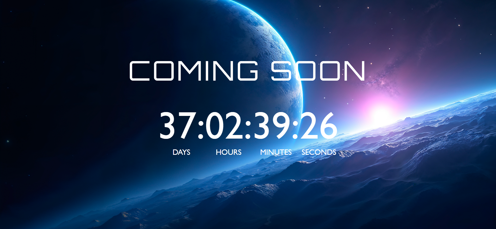
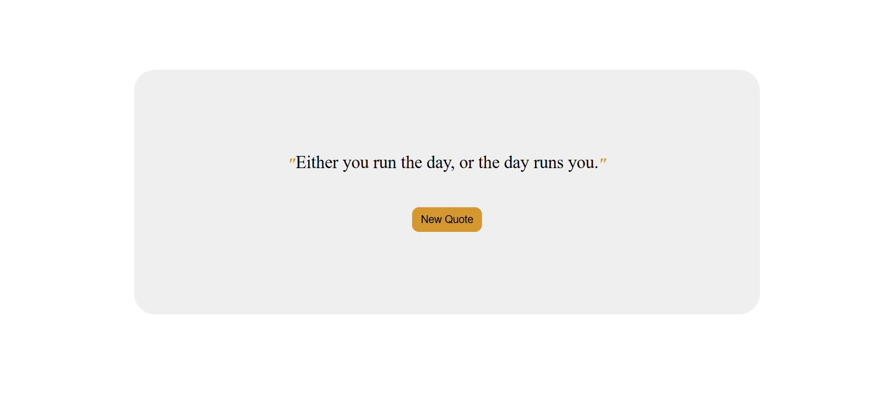

# 🌟 Mini Frontend Projects Collection

This repository contains **3 mini projects** created using **HTML, CSS, and JavaScript**.  
These projects are beginner-friendly and demonstrate various **frontend functionalities** such as animations, timers, and API usage.

---

## 📁 Projects Included

### 1️⃣ Automatic Carousel
A simple image carousel that **automatically slides images** at fixed intervals.  
- Smooth slide transitions  
- Fully responsive layout  
- No manual interaction needed

---

### 2️⃣ Countdown App
A countdown timer app to **track remaining time for a target date**.  
- Real-time countdown display  
- Days, Hours, Minutes, Seconds  
- Clean and minimal UI

---

### 3️⃣ Quotes App
An app that **displays random motivational quotes** on button click.  
- Fetches quotes from an API  
- Displays author name  
- Refresh for new random quotes

---

## 🛠️ Tech Stack

    
  <b>HTML5</b> — Structure of the web pages  
    

    
  <b>CSS3</b> — Styling and layout  
    

    
  <b>JavaScript</b> — Logic, interactivity, and API calls  

---

## 📸 Project Previews

### 🖼️ Automatic Carousel

### ⏳ Countdown App

### 💬 Quotes App

